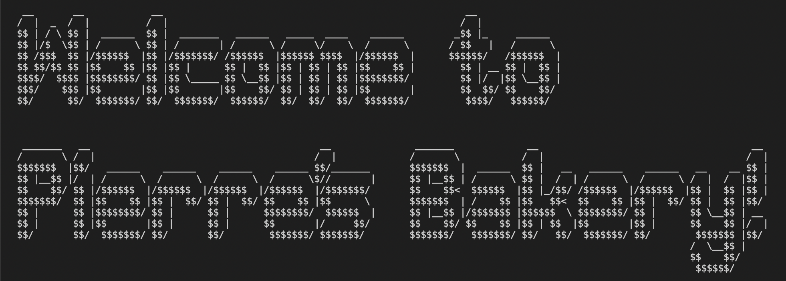

# _Pierre's Bakery_

#### _A console application that allows a user to place an order for bread and/or pastries_

#### By _**Chloe Loveall**_
<br>

 &nbsp;  &nbsp;  &nbsp;  &nbsp;  &nbsp; 

## Table of Contents

1. [Table of Contents](#table-of-contents)
2. [Description](#description)
4. [Technologies Used](#technologies-used)
5. [Setup/Installation Requirements](#setup-&-installation-requirements)
    * [Installation](#installation)
6. [Specifications](#specifications)
7. [Known Bugs](#known-bugs)
8. [Contributing](#contributing)
9. [License](#license)
10. [Acknowledgements](#acknowledgements)
11. [Contact Information](#contact-information)

## Description

More detailed description

## Technologies Used

* C#
* MSTest
* .NET

## Setup & Installation Requirements

### Installation
* Clone the repository with the following git terminal command: ```$ git clone https://github.com/chloeloveall/PierresBakery.Solution.git```
* Open the project directory in your terminal
* 

navigate to PierresBakery.Tests directory, run $ dotnet restore, this will create obj directories in both production and test projects. Do not touch this code.

## Specifications

| Behavior                                                         | Input  | Output  |
| ---------------------------------------------------------------- | :----- | :------ |
| User will receive a welcome message when they run the program             | user runs the program | Welcome to Pierre's Bakery! |
| User will receive a message with the cost of Bread                        | user runs the program | Bread: Buy 2, get 1 free. A single loaf costs $5. |
| User will receive a message with the cost of Pastry                       | user runs the program  | Pastry: Buy 1 for $2 or 3 for $5. |
| User receives an order prompt for Bread                                   | user runs the program  | How many loaves of bread would you like? |
| Program will add loaves of bread to order total                           | 1                      | $5
| User receives an order prompt for Pastry                                  | user bread order input | How many pastries would you like to add to your order? |
|  User receives an order prompt for Pastry                                 | 1                      | $2 |

## Known Bugs

* None at this time

## Contributing

Contributions are what make the open source community such an amazing place to be learn, inspire, and create. Any contributions you make are greatly appreciated.

1. Fork the project on GirHub
    * Follow [Installation/Setup Instructions](#setup-&-installation-requirements) above
2. Create your Feature Branch: ```$ git checkout -b YourFeatureBranchName```
3. Commit your Changes ```$ git commit -m 'Add some Amazing Feature'```
4. Push to your feature branch on Github ```$ git push origin YourFeatureBranchName```
5. Open a Pull Request

## License

[MIT](LICENSE.md)

## Acknowledgements

* [Shields](https://shields.io/)
* [Choose an open source license](https://choosealicense.com/)

## Contact Information

_Chloe Loveall <chloeloveall@protonmail.com>_

 &nbsp;  &nbsp; 

[Back to Top](#table-of-contents)